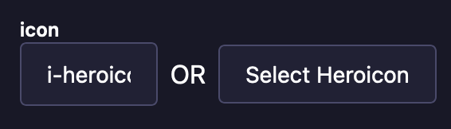
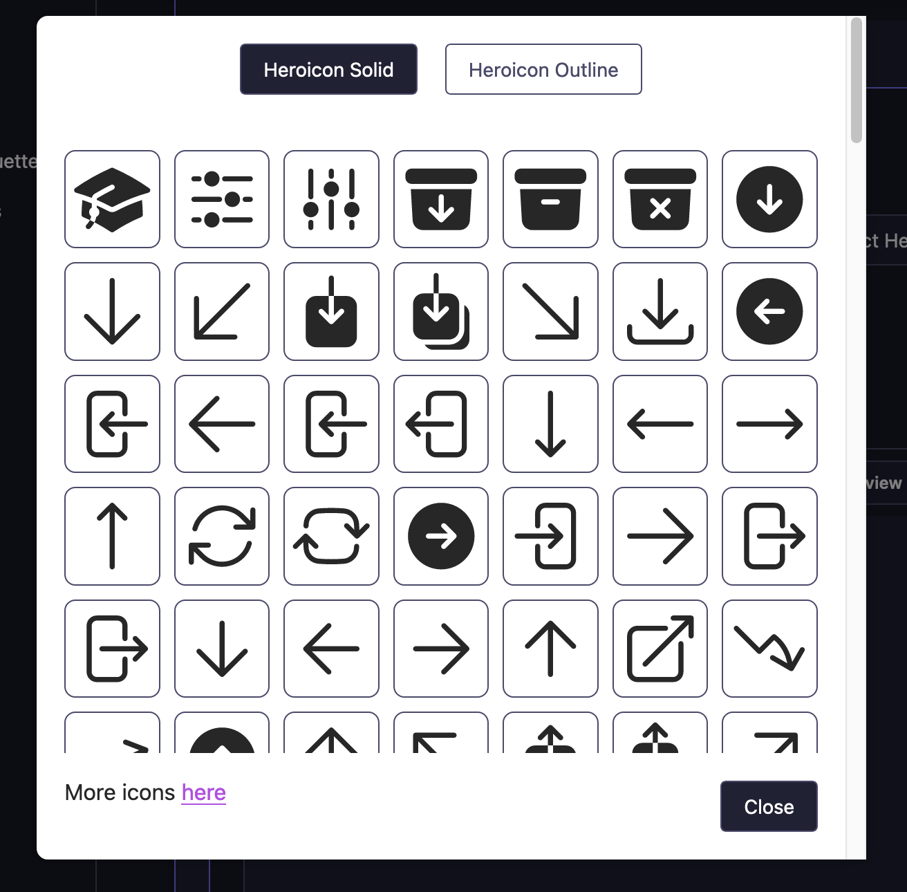

# strapi-NuxtUI-iconify
This plugin allows user to visually select icons for usage with the [Icon - NuxtUI](https://ui.nuxt.com/components/icon) component. Icons use the string format `i-{collection_name}-{icon_name}` and can still be typed in manually in the text input field. For now, only the heroicon library is implemented but any contribution to add more compatible libraries from [icones.js](https://icones.js.org/) are welcome.

## Screenshots

