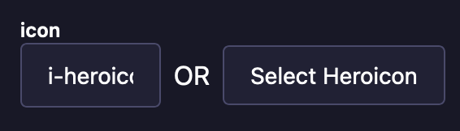
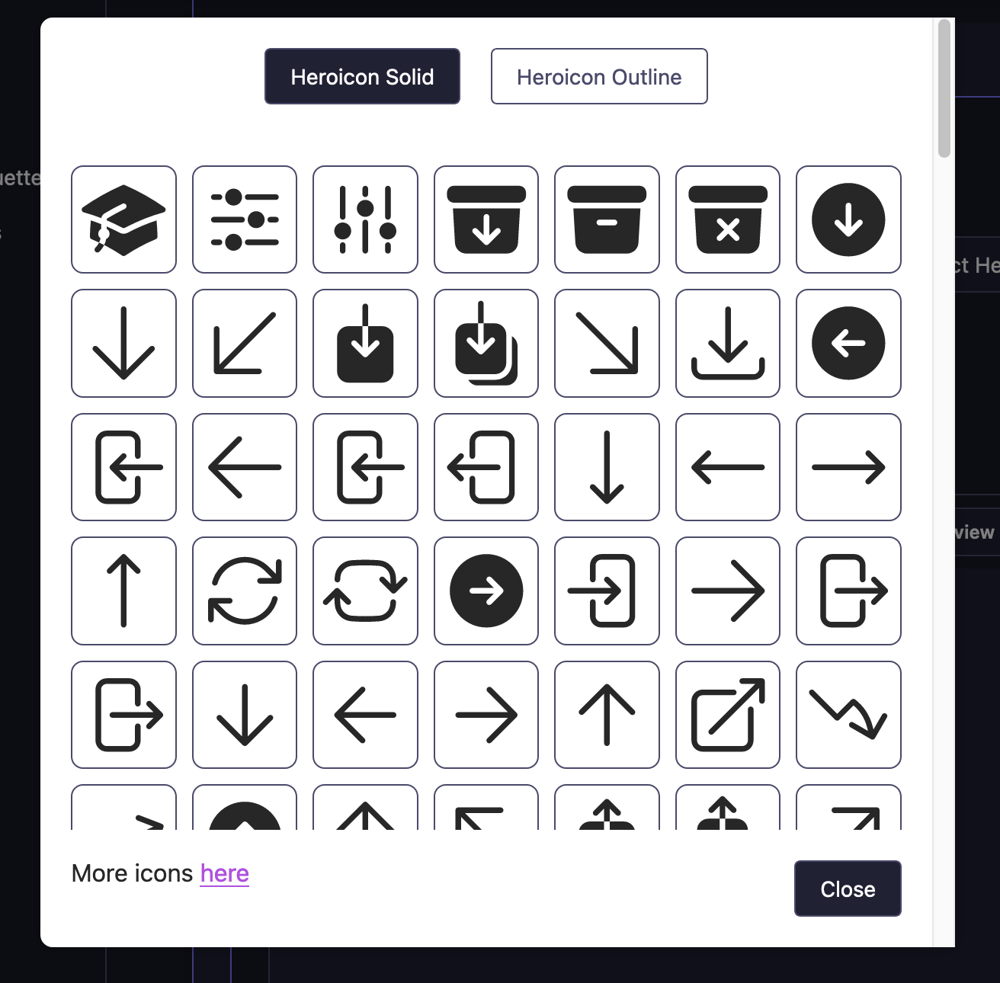

# strapi-NuxtUI-iconify

This plugin allows users to visually select icons for usage with the [Icon - NuxtUI](https://ui.nuxt.com/components/icon) component. Icons use the string format `i-{collection_name}-{icon_name}` and can still be typed in manually in the text input field. For now, only the heroicon library is implemented but any contribution to add more compatible libraries from [icones.js](https://icones.js.org/) are welcome.

## Installation

To install this plugin, you need to add an NPM dependency to your Strapi application.

```bash
# Using Yarn
yarn add strapi-nuxtui-icon

# Or using NPM
npm install strapi-nuxtui-icon
```

## Configuration

No specific configuration needed for now.

`./config/plugin.js`

```javascript
module.exports = ({ env }) => ({
  // ...
  nuxticons: {
    enabled: true,
    config: {
      /*No Config for now */
    },
  },
  // ...
});
```

## Use

To use this plugin in your strapi app, simply add the custom field to one of your content-type.

You can now use the `Select Heroicon` button to view and select an icon from the heroicon library (contributions for more libraries are welcome).

You can also type in manually the icon you need from [icones.js](https://icones.js.org/)

```javascript
"icon": {
  "type": "customField",
  "customField": "plugin::nuxticon.nuxticon"
}
```

### Front end

In your app, you can now give this string to a [NuxtUI Icon](https://ui.nuxt.com/components/icon) component.

## Screenshots



